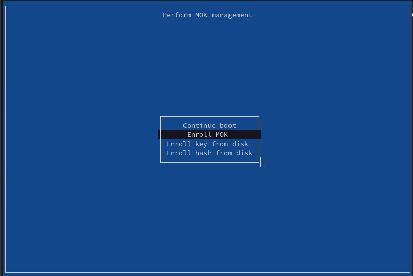

# DGX Spark RAM reclaim

This repository documents two tested memory gains on NVIDIA DGX Spark:

1. use NVIDIA's 64 KiB kernel to reduce page metadata; and
2. return the 2046 MiB headless display reservation to normal Linux RAM.

Together they add **4.096 GiB** to `MemTotal`.

[Blog: Recovering 4.1 GiB of RAM on NVIDIA DGX Spark](https://www.junczys.net/blog/recovering-4-1-gib-dgx-spark/)

## 1. Install the 64 KiB kernel

NVIDIA documents the supported procedure in
[Installing the 64K Kernel](https://docs.nvidia.com/dgx/dgx-os-7-user-guide/installing_on_ubuntu.html).
Install the exact tested kernel, NVIDIA modules, headers, and tools:

```sh
sudo apt-get update
sudo apt-get install -y --no-install-recommends \
  linux-image-7.0.0-1019-nvidia-64k \
  linux-headers-7.0.0-1019-nvidia-64k \
  linux-modules-7.0.0-1019-nvidia-64k \
  linux-modules-nvidia-580-open-7.0.0-1019-nvidia-64k \
  linux-modules-nvidia-fs-7.0.0-1019-nvidia-64k \
  linux-tools-7.0.0-1019-nvidia-64k
```

Keep the existing 4 KiB kernel installed as a GRUB fallback. Select the 64 KiB
kernel and disable Transparent Huge Pages:

```sh
sudo tee /etc/default/grub.d/99-64k-default.cfg >/dev/null <<'EOF'
GRUB_DEFAULT="Advanced options for DGX OS GNU/Linux>DGX OS GNU/Linux, with Linux 7.0.0-1019-nvidia-64k"
EOF

sudo tee /etc/default/grub.d/zz-dgx-spark-64k-thp.cfg >/dev/null <<'EOF'
GRUB_CMDLINE_LINUX_DEFAULT="$GRUB_CMDLINE_LINUX_DEFAULT transparent_hugepage=never"
EOF

sudo update-grub
sudo systemctl reboot
```

The 64 KiB kernel otherwise uses 512 MiB THP pageblocks and raised
`vm.min_free_kbytes` to 6,358,528 KiB on the tested Sparks. Disabling THP
reduced it to about 45,500 KiB.

After reboot, verify:

```sh
uname -r
getconf PAGE_SIZE
cat /sys/kernel/mm/transparent_hugepage/enabled
sysctl vm.min_free_kbytes
```

Expected values include `7.0.0-1019-nvidia-64k`, `65536`, `[never]`, and roughly
`45500`.

Expected `MemTotal` with the same crash-kernel reservation:

| Kernel | `MemTotal` |
| --- | ---: |
| 4 KiB | ~125,370,544 KiB / 119.56 GiB |
| 64 KiB | 127,570,560 KiB / 121.66 GiB |
| **Increase** | **2,200,016 KiB / 2.098 GiB** |

## 2. Reclaim the display reservation

The preflight check refuses anything other than the tested Spark hardware,
firmware, kernel, driver, page size, and RM memory layout. The adjacent 48 MiB
UEFI range is never released. Rebooting restores the stock driver and display
reservation.

### Build

```sh
sudo apt-get install -y git make gcc-13 python3 openssl mokutil kmod psmisc
git clone https://github.com/emjotde/spark-ram-reclaim.git
cd spark-ram-reclaim
make test
sudo make preflight
make build
```

The build also uses `/usr/local/cuda/bin/nvcc` from the NVIDIA CUDA toolkit
included with DGX OS.

### Create and enroll the key

> [!WARNING]
> The enrollment screen appears during boot, before Linux and SSH are available.
> Connect a monitor and keyboard to the Spark before running these commands.
> The temporary password is entered on that local screen.

Create the key and queue its public certificate for enrollment. `mokutil` asks
you to create and confirm a temporary password; enter that same password once
in MokManager after reboot. This one-time password is separate from the
root-owned module-signing key, which has no passphrase.

```sh
sudo make key
sudo mokutil --import /root/.local/share/gb10-ram-reclaim/keys/module.der
sudo systemctl reboot
```

MokManager opens on the next boot:



Screenshot from the
[Piraeus Operator documentation](https://github.com/piraeusdatastore/piraeus-operator/blob/v2/docs/assets/mok-enroll.png),
Apache-2.0 license.

Use the keyboard to select:

```text
Enroll MOK -> Continue -> Yes -> enter the temporary password -> Reboot
```

After Linux starts:

```sh
sudo mokutil --test-key /root/.local/share/gb10-ram-reclaim/keys/module.der
sudo make preflight
sudo make sign
```

The key and signed modules are stored under
`/root/.local/share/gb10-ram-reclaim/`.

### Reclaim

Start with `/dev/nvidia*` unused:

```sh
./spark-reclaim status
./spark-reclaim reclaim --dry-run
sudo ./spark-reclaim reclaim
```

The command performs the exact platform preflight, signed-module and reserved
page checks, stock allocation checks, NVIDIA module unload, reversible mapping
test, guarded-driver checks, three-stage release, exact `MemTotal` checks, and
CUDA physical-page coverage.

Success ends with:

```text
Reclaimed 2095104 kB. MemTotal=... kB.
```

The guarded driver and reclaim modules remain loaded. Reboot restores the stock
driver and original reservation; the enrolled MOK remains.

## Result

| Configuration | `MemTotal` | Increase |
| --- | ---: | ---: |
| 4 KiB kernel | ~125,370,544 KiB / 119.56 GiB | — |
| 64 KiB kernel | 127,570,560 KiB / 121.66 GiB | 2,200,016 KiB / 2.098 GiB |
| 64 KiB kernel, crash-kernel reservation removed | 129,798,784 KiB / 123.79 GiB | 2,228,224 KiB / 2.125 GiB |
| After display reclaim | 131,893,888 KiB / 125.78 GiB | 2,095,104 KiB / 2046 MiB |

The 64 KiB kernel and display reclaim together add **4,295,120 KiB
(4.096 GiB)**. Removing the crash-kernel reservation is a separate change.

The reclaimed range passed full-range CPU pattern tests, CUDA writes through
normal pinned host allocations, and a normal `cudaMalloc` fill and copyback.

## How it works

The NVIDIA driver patch disables both reviewed scanout-carveout allocation paths.
Three kernel modules then test and release the range in 2 MiB, 1022 MiB, and
1022 MiB stages. They verify page state, create direct mappings, run CPU patterns,
clear `MEMBLOCK_NOMAP`, and call `free_reserved_page()`.

The modules use Linux livepatch ELF relocations to resolve eight private kernel
symbols. They pin themselves and the guarded driver after releasing pages, so
normal module unload cannot restore the stock allocator over live RAM.

## Attribution and license

This DGX Spark/64 KiB port was developed and validated by
**Marcin Junczys-Dowmunt** from
[Jon Taylor's ASUS GX10 implementation](https://github.com/jontaylor/gb10-ram-reclaim).

The original display-memory discovery is by **Emi Huang (`coolbho3k`)**:
[forum post](https://forums.developer.nvidia.com/t/383583/1) and
[CUDA allocator](https://github.com/coolbho3k/DeepSeek-v4.1-Flash-2x-DGX-Spark/blob/878e0eecd893fadc69ad2d58b2df0fabb0fae2ee/release/runtime/sources/display_kv.c).

Project code and documentation are GPL-2.0-only. Additions to NVIDIA's
MIT-licensed files remain MIT-licensed. See [NOTICE](NOTICE).

GPL-2.0-only is required because this port derives from Jon Taylor's GPL-2.0
implementation and its kernel modules use GPL-only Linux interfaces. Those
inherited parts cannot be relicensed as MIT independently. The NVIDIA patch is
kept under MIT because it modifies MIT-licensed upstream files.
